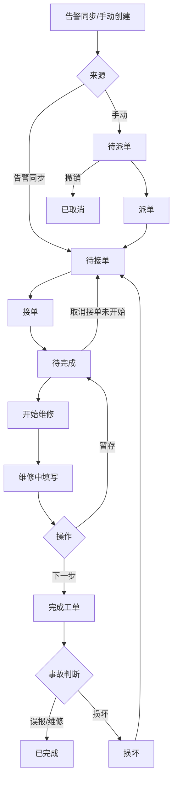

# 溧阳消防局智慧消防平台 — 告警中心 / 设施工单 / 小程序设施工单 PRD

| 属性 | 内容 |
| --- | --- |
| 文档版本 | V2.0 |
| 模块范围 | 告警中心（统计/列表/设置）、中台设施工单、小程序设施工单全流程 |
| 原型代码路径 | `src/pages/alarm/`、`src/pages/FacilityWorkOrder.tsx`、`src/store/alarmSync.ts`、`src/miniapp/` |
| 适用角色 | 消防管理员（中台）、维修人员（小程序，原型用户：张维修） |
| 文档状态 | 严格基于当前原型实现，可直接交付开发 |

---

# 一、模块整体概述

## 1.1 模块名称、角色与业务目标

| 子模块 | 使用角色 | 核心业务目标 |
| --- | --- | --- |
| 告警中心 | 消防管理员 | 配置告警规则、查看告警清单与统计态势，支撑告警处置决策 |
| 中台设施工单 | 消防管理员 | 集中查看由告警同步或手动产生的设施工单，跟踪中台状态，维护损坏说明 |
| 小程序设施工单 | 维修人员 | 在移动端完成接单、现场维修、完成闭环；管理员在小程序完成派单/催单/撤销 |

**端到端目标：** 告警设置定义规则 → 设备/系统触发告警 → 告警列表记录 →（设备超时等）同步设施工单 → 维修人员小程序处置 → 中台设施工单状态同步更新。

## 1.2 页面/功能入口与跳转关系

### 中台（MainLayout + MenuKey 内存路由）

```
告警中心
├── 告警统计 (alarm-stats)
├── 告警列表 (alarm-list)
└── 告警设置 (alarm-settings)

工单管理（独立一级菜单）
└── 设施工单 (facility-work-order)
```

**跳转规则：**

- 侧栏点击 → `onNavigate(menuKey)` → 内容区渲染对应组件；非首页自动打开/激活顶部 Tab。
- 告警中心三页、设施工单页**无页面内跨模块按钮跳转**，仅通过侧栏/Tab 切换。
- 告警列表「模拟恢复」→ 调用 `closeFacilityByAlarm` → **联动关闭**关联设施工单（内存 store 同步，中台设施工单页订阅刷新）。

### 小程序（MiniProgramApp 内存路由）

```
底部 Tab
├── 首页 (home)
│   └── 工单受理 → 设施工单 → 工单列表 (list/facility)
│   └── 工单受理 → 我的工单 (my-orders)
├── 协作 (collab) → 我的服务 → 我的工单 (my-orders)
├── 数据 (data)  【引用告警统计 KPI，非本 PRD 主流程】
└── 我的 (profile)

设施工单子路由
├── 工单列表 (list, type=facility)
├── 工单详情 (detail, id)
└── 表单页 (facility-form)
    ├── dispatch 派单
    ├── urge 催单
    ├── revoke 撤销
    ├── cancel 取消接单
    ├── repairing 维修中
    └── complete 完成工单
```

**设施工单典型跳转链：**

1. 首页/协作 → 设施工单列表 → 点击卡片 → 详情 → 接单/开始维修/继续处理 → 维修中 → 下一步 → 完成工单 → 提交 → 回详情。
2. 待派单详情 → 派单/催单/撤销表单 → 确定 → 回详情。
3. 我的工单 → 我的待办（仅本人待完成）→ 详情/表单。

## 1.3 全局枚举字典

### A. 告警等级（ALARM_LEVELS）

| 枚举值 | 业务含义 | UI 表现 |
| --- | --- | --- |
| 一级告警 | 最高优先级，需立即响应 | Tag `#ff4d4f` |
| 二级告警 | 高优先级 | Tag `#fa8c16` |
| 三级告警 | 中等优先级 | Tag `#fadb14` |
| 四级告警 | 一般提示 | Tag `#1890ff` |

统计页实时列表使用文案「一级预警~四级预警」，颜色映射同上（LEVEL_WARN_COLORS）。

### B. 告警状态（ALARM_STATUS，告警列表）

| 枚举值 | 业务含义 | UI 表现 |
| --- | --- | --- |
| 待处理 | 告警产生，尚未处置 | Tag `processing`（蓝） |
| 已处理 | 已完成处置或设备自动恢复 | Tag `success`（绿） |
| 误报 | 判定为误报 | Tag `warning`（橙） |
| 损坏 | 关联设备损坏 | Tag `error`（红） |

### C. 告警描述类型（ALARM_DESC_TYPES）

| 枚举值 | 业务含义 |
| --- | --- |
| 火灾报警 | 火灾类告警 |
| 故障报警 | 设备故障类 |
| 设备超时 | 设备离线超时；列表可对「待处理」行执行「模拟恢复」 |

### D. 中台设施工单状态（FACILITY_ORDER_STATUS）

| 枚举值 | 业务含义 | 与小程序映射 | UI（中台 Tag） |
| --- | --- | --- | --- |
| 待处理 | 未进入维修或已取消 | 待派单/待接单/已取消 | `warning` |
| 处理中 | 维修进行中 | 待完成 | `processing` |
| 已处理 | 维修闭环完成 | 已完成 | `success` |
| 损坏 | 判定设备损坏 | 损坏 | `error` |

### E. 小程序设施工单状态（MINI_FACILITY_STATUS）

| 枚举值 | 业务含义 | UI（小程序角标 class） | 工单列表可见性 |
| --- | --- | --- | --- |
| 待派单 | 手动创建，未派单 | `mini-status-pending` | 全员（工单池） |
| 待接单 | 可接单 | `mini-status-wait` | 全员（工单池） |
| 待完成 | 接单后至提交前（含维修中/暂存，统一节点） | `mini-status-processing` | **仅接单人**；列表筛选项保留 |
| 已完成 | 闭环完成 | `mini-status-done` | **全员** |
| 已取消 | 待派单撤销 | `mini-status-cancel` | **不可见**；仅「我的已办」 |
| 损坏 | 提交损坏 | `mini-status-damage` | 全员（可再次接单） |

**说明：** 历史「处理中」在代码层归一化为「待完成」（`legacyMiniStatus`）。

### F. 告警事故判断（IncidentJudgment，完成工单）

| 枚举值 | 业务含义 | 提交后小程序状态 |
| --- | --- | --- |
| 误报 | 现场核实为误报 | 已完成 |
| 维修 | 现场维修完成 | 已完成 |
| 损坏 | 设备损坏 | 损坏（接单人清空，可再次被接单） |

### G. 派单工作组 / 人员（小程序）

| 工作组 | 可选人员 |
| --- | --- |
| 设施维修一组 | 张维修、李维修、王运维 |
| 设施维修二组 | 赵工、刘工 |
| 消防维保组 | 陈维保、周维保 |

原型当前登录用户：`张维修`（`MINI_CURRENT_USER`）。

### H. 阈值模式（告警设置）

| 枚举值 | 含义 | 展示文案 |
| --- | --- | --- |
| none | 仅第三方推送 | 「无」 |
| deviceTimeout | 离线超时触发 | 「设备离线超过{N}分钟（设备超时报警）」；N 默认 30，范围 1~1440 |

---

# 二、分页面需求说明

---

## 页面一：告警统计（alarm-stats）

### 1. 页面用途与业务场景

为消防管理员提供告警态势 Dashboard：KPI、等级分布、趋势、实时告警流。用于日常巡检前掌握待处置量、对比人防/技防实时告警。

### 2. 页面布局与区域划分

| 区域 | 内容 |
| --- | --- |
| 顶部筛选 Card | 标题 + 人防/技防 + 日/月/年 + DatePicker + 【查询】 |
| KPI 区（4 列） | 待处置、处置超时、设备告警、事件上报 |
| 左栏图表 | 告警等级分布饼图、告警趋势折线图（带今日/本月/全年子筛选） |
| 右栏列表 | 实时告警 List |
| 弹窗 | 告警详情 Modal（实时列表「详情」触发） |

### 3. 筛选与查询逻辑

| 筛选项 | 默认值 | 可选范围 | 生效规则 |
| --- | --- | --- | --- |
| 人防/技防 | 技防数据 | 人防数据、技防数据 | 切换后**立即**更换实时列表数据源；不影响 KPI/图表 |
| 日/月/年 | 月 | day/month/year | 切换后联动 DatePicker 格式；**即时**重算 KPI（系数：日×0.3、月×1、年×3） |
| 日期 | 2025-01 | 随 period 变化 | allowClear=false；【查询】仅 Toast「查询成功」，不按日期重算 |
| 趋势子筛选 | 本月 | 今日/本月/全年 | **即时**重绘折线图 |

无【重置】按钮。

### 4. 功能按钮交互

| 按钮/链接 | 操作 → 系统响应 |
| --- | --- |
| 查询 | Toast「查询成功」，无数据刷新 |
| 实时列表「详情 ›」 | 打开 Modal，展示名称/等级/数据类型/时间；footer=null，点遮罩关闭 |

### 5. 数据展示

- KPI：来自 `getKpiCards(period)`，数值蓝色 `#1890ff`。
- 饼图：`getLevelDistributionFour()` 固定比例，颜色 LEVEL_COLORS。
- 实时列表：人防 4 条 / 技防 4 条；左侧色条按 level 1~4 着色。

### 6. 分页与加载

无分页。列表空时区域空白（正式建议 Empty 文案）。

### 7. 弹窗

**告警详情 Modal：** 只读；无提交按钮。

### 8. 跳转与联动

仅菜单/Tab 进入；无跨页参数。

### 9. 异常场景

接口失败未实现；建议保留上次数据 + Message.error。

---

## 页面二：告警列表（alarm-list）

### 1. 页面用途与业务场景

展示告警记录，支持筛选与详情；对「设备超时 + 待处理」提供模拟恢复并联动关单设施工单。

### 2. 页面布局

| 区域 | 内容 |
| --- | --- |
| SearchBar 筛选区 | 等级、状态、描述 Select + 告警时间 RangePicker（**未绑定**）+ 搜索/重置 |
| 表格区 | 10 列 + 操作列 |
| 分页 | 默认 pageSize=10，showSizeChanger |
| Modal | 告警详情 |

### 3. 筛选与查询逻辑

| 筛选项 | 默认 | 规则 |
| --- | --- | --- |
| 告警等级 | 空 | allowClear；**即时**过滤 |
| 告警状态 | 空 | 待处理/已处理/误报/损坏；即时过滤 |
| 告警描述 | 空 | 火灾/故障/设备超时；即时过滤 |
| 告警时间 Range | 未接线 | UI 展示不参与过滤 |
| 搜索 | — | Toast「搜索完成」，不改变结果 |
| 重置 | — | 清空三个 Select；RangePicker 不变 |

组合逻辑：**AND**；某条件空则忽略。

### 4. 功能按钮交互

| 操作 | 条件 | 用户操作 → 系统响应 |
| --- | --- | --- |
| 详情 | 始终 | 打开 Modal 只读详情 |
| 模拟恢复 | status=待处理 且 desc=设备超时 | 写 releaseTime、status→已处理、autoResolved=true；`closeFacilityByAlarm(id)`；Toast 成功文案；**无二次确认** |

### 5. 数据列表

| 列 | 字段 | 展示 |
| --- | --- | --- |
| 序号 | index+1 | — |
| 告警ID | id | 原文 |
| 告警名称 | name | 原文 |
| 告警等级 | level | 彩色 Tag |
| 告警设备 | alarmDevices | join「、」 |
| 安装位置 | installLocation | 原文，ellipsis |
| 告警描述 | desc | 原文 |
| 告警状态 | status | Tag 配色见枚举 |
| 告警时间 | time | 原文 |
| 解除告警时间 | releaseTime | 空显示「-」 |
| 操作 | — | 详情；条件显示模拟恢复 |

**无复选框、无批量操作。**

详情 Modal 设施工单字段：当 `desc=设备超时` 或 `status=待处理` 时显示 `SG-{id}（告警同步）`，否则「—」。

### 6. 分页

默认第 1 页、每页 10 条；showTotal「共 n 条」；客户端对 filtered 分页。

### 7. 弹窗

告警详情 Modal：footer 仅【关闭】。

### 8. 跳转与联动

模拟恢复后设施工单 store 更新 → 中台设施工单页 `subscribeFacility` 自动刷新。

### 9. 异常场景

筛选无结果：表格 Empty；已恢复行不再显示「模拟恢复」。

---

## 页面三：告警设置（alarm-settings）

### 1. 页面用途与业务场景

按「一级类别→二级子类」配置告警等级与阈值；树表展示已配置子类及子级数量（三级设备总数）。

### 2. 页面布局

| 区域 | 内容 |
| --- | --- |
| SearchBar | 设备关键词、等级、创建时间 Range + 搜索/清空 |
| TableToolbar | 新增、批量删除、选中提示 |
| 树形 Table | 一级 root / 二级 category |
| Modal | 新增/编辑告警设置 |

### 3. 筛选与查询逻辑

| 筛选项 | 应用时机 | 规则 |
| --- | --- | --- |
| 设备关键词 | 点搜索 | 模糊匹配 rootCategory、subCategory |
| 等级 | 点搜索 | 精确匹配 |
| 创建时间 | 点搜索 | 落在区间内（含起止日全天） |
| 搜索 | — | draft→applied；有条件则展开命中一级节点；Toast「查询完成」 |
| 清空 | — | 清空 draft+applied+展开状态；无 Toast |

### 4. 功能按钮交互

| 按钮 | 操作 → 系统响应 |
| --- | --- |
| 新增 | 打开 Modal；默认三级告警、deviceTimeout、30 分钟 |
| 批量删除 | 未选 disabled；Confirm 后删除；success |
| 行编辑 | 打开 Modal；设备 Cascader **禁用** |
| 行删除 | Confirm「确认删除」含路径；danger |
| 保存 | validateFields；新增去重；success 文案区分跳过条数 |
| 取消 | 关闭 Modal，destroyOnClose |

### 5. 数据列表

| 列 | 一级行 | 二级行 |
| --- | --- | --- |
| 告警设备 | 类别名，可展开 | 子类名 |
| 子级数量 | 空 | catalog 三级设备数 |
| 阈值 | 空 | thresholdDisplay |
| 告警等级 | 空 | Tag |
| 创建时间 | 空 | createTime |
| 操作 | 空 | 编辑、删除 |

**勾选：** 仅二级行可勾选（checkStrictly）；一级 disabled。

### 6. 分页

pageSize=10；showTotal 为**规则条数** filteredRules.length。

### 7. 弹窗表单字段

| 字段 | 必填 | 新增 | 编辑 |
| --- | --- | --- | --- |
| 告警设备 Cascader | ✅ | 多选二级子类 | 禁用 |
| 告警等级 | ✅ | 可选 | 可改 |
| 阈值类型 | ✅ | none/deviceTimeout | 可改 |
| 离线判定时长 | 条件 | 1~1440 分钟 | 同左 |

### 8. 异常场景

全重复新增：error「所选子类均已配置」；未选批量删除：warning。

---

## 页面四：中台设施工单（facility-work-order）

### 1. 页面用途与业务场景

管理员集中查看全部设施工单（告警同步/手动），按中台状态 Tab 与多维筛选检索，查看详情，对「损坏」工单填写损坏说明。

**数据同步：** 订阅 `subscribeFacility`，与小程序操作、告警模拟恢复实时联动。

### 2. 页面布局

| 区域 | 内容 |
| --- | --- |
| SearchBar | 工单状态、告警等级、告警设备、告警月份 + 搜索/重置 |
| 状态 Tabs | 全部/处理中/未处理/已处理/损坏 |
| 提示条 Alert | 损坏工单可再次被维修人员接单 |
| 表格 | 动态列（损坏说明列条件显示） |
| Modal | 工单详情 + 损坏说明编辑 |

### 3. 筛选与查询逻辑

| 筛选项 | 默认 | 规则 |
| --- | --- | --- |
| 工单状态 | 空 | FACILITY_ORDER_STATUS 四值；**点搜索后** applied 过滤 |
| 告警等级 | 空 | 精确匹配 level |
| 告警设备 | 空 | alarmDevices 数组包含所选设备 |
| 告警月份 | 空 | alarmTime 前缀匹配 YYYY-MM |
| 状态 Tab | 全部 | 与 SearchBar **叠加** AND：Tab 映射 status（未处理=待处理） |
| 搜索 | — | draft→applied，**不 Toast** |
| 重置 | — | 清空 draft+applied，Tab 回「全部」 |

### 4. 功能按钮交互

| 操作 | 条件 | 响应 |
| --- | --- | --- |
| 查看 | 始终 | 打开详情 Modal |
| 填写说明 | status=损坏 | 同查看，聚焦损坏说明区 |
| 保存损坏说明 | 详情且损坏 | `updateFacilityDamageNote`；Toast「损坏说明已保存」；更新本地 detail |

**无新增/删除/派单按钮（派单在小程序）。**

### 5. 数据列表

| 列 | 释义 | 展示 |
| --- | --- | --- |
| 序号 | 行号 | 1 起 |
| 工单编号 | id | 如 SG20260601001 |
| 告警设备 | alarmDevices | join「、」 |
| 安装位置 | installLocation | 原文 |
| 告警等级 | level | Tag LEVEL_COLORS |
| 告警描述 | desc | 原文 |
| 告警时间 | alarmTime | 原文 |
| 工单状态 | status | 中台四态 Tag |
| 接单人 | receiver | 无则显示「-」 |
| 损坏说明 | damageNote | 仅 Tab=全部或损坏时显示；损坏空显示灰色「待填写」 |
| 操作 | 查看/填写说明 | 损坏多「填写说明」 |

**无复选框、无批量操作。**

### 6. 分页

默认 10 条/页，showSizeChanger，showTotal「共 n 条」。

### 7. 弹窗：工单详情

| 字段 | 说明 |
| --- | --- |
| 工单编号/设备/位置/等级/描述/时间/状态/接单人/来源 | 只读 Descriptions |
| 损坏说明 TextArea | 仅损坏状态；maxLength=500，showCount |
| Footer | 损坏：【关闭】【保存损坏说明】；其他：仅遮罩关闭（footer=null） |

### 8. 跳转与联动

小程序改状态 → notifyFacility → 本页列表刷新。告警模拟恢复 → 工单变已处理。

### 9. 异常场景

筛选无数据：Empty；非损坏工单无保存按钮。

---

## 页面五：小程序 — 工单列表·设施 Tab（list/facility）

### 1. 页面用途与业务场景

维修人员浏览可接工单池、本人待完成、全员可见已完成；按状态 Chip 筛选。导航标题「**工单列表**」。

### 2. 页面布局

| 区域 | 内容 |
| --- | --- |
| 顶栏 | 返回 + 标题「工单列表」+ 胶囊按钮 |
| 类型 Tab | 报修/设施/维保/巡检（设施选中） |
| 状态 Chip 行 | 全部 + 各状态（**不含已取消**） |
| 卡片列表 | OrderCard |

### 3. 筛选逻辑

| 筛选项 | 默认 | 规则 |
| --- | --- | --- |
| 类型 Tab | 从入口带入 facility | 切换重置 statusFilter |
| 状态 Chip | 全部（null） | 精确匹配 order.status |
| 设施数据源 | `getFacilityListOrders` | 见可见性规则 |

**设施可见性（isVisibleInWorkOrderList）：**

- 排除：已取消
- 包含：工单池（待派单、待接单、损坏）、本人待完成、全员已完成

### 4. 功能交互

| 操作 | 响应 |
| --- | --- |
| 点击卡片 | 跳转详情 `detail/id` |
| 返回 | 回上一页（通常首页） |

### 5. 列表卡片字段

| 展示 | 来源 |
| --- | --- |
| 类型 Tag「设施」 | MINI_TYPE_LABELS |
| 时间 | createTime |
| 状态 | status 或归档操作类型 |
| 问题类型 | 设施工单 |
| 问题描述 | 告警设备 |
| 安装位置 | extra.安装位置（有则显示） |

### 6. 分页与空状态

无分页；无数据文案「暂无工单」。

---

## 页面六：小程序 — 设施工单详情（detail）

### 1. 页面用途与业务场景

查看工单基础信息与流程时间轴；按状态与身份展示底部操作按钮。

### 2. 页面布局

| 区域 | 内容 |
| --- | --- |
| 申请详情 Card | 状态角标 + 基础信息 KV |
| 流程记录 Card | 时间轴（fields/images） |
| 底部 Footer | 条件按钮 |

### 3. 底部按钮规则

| 状态 | 条件 | 按钮 | 操作 → 响应 |
| --- | --- | --- | --- |
| 待派单 | — | 撤销、催单、派单 | 打开对应表单页 |
| 待接单/损坏 | — | 接单 | `acceptFacilityOrder`→待完成；刷新 |
| 待完成 | 接单人=当前用户 且未开始维修 | 取消接单、开始维修 | 取消→表单；开始→`startFacilityRepair`+进维修中页 |
| 待完成 | 接单人=当前用户 且已开始 | 继续处理 | 进维修中页 |
| 已完成/已取消 | — | 无按钮 | — |

**说明：** 待完成工单仅接单人可见于列表，但待派单/待接单/损坏/已完成全员可见规则见列表页。

### 4. 基础信息字段

工单编号、告警设备、安装位置、告警等级、告警描述、告警时间、来源、发起人、接单人、派单工作组/说明、到达现场时间、故障原因、损坏说明（有则显示）。

### 5. 流程记录

每条含：操作人、动作、时间、fields 键值对、可选图片网格。

---

## 页面七：小程序 — 派单/催单/撤销/取消接单表单

### 1. 页面用途

待派单阶段派单、催单、撤销；待完成未开始维修时取消接单。

### 2. 布局

标题 Card（派单处理/催单提醒/撤销审批/取消接单）+ 表单区 + 底部【取消】【确定】。

### 3. 字段与校验

| 表单 | 字段 | 必填 | 规则 |
| --- | --- | --- | --- |
| 派单 | 工作组+处理人员 | ✅ | 两级 Select 联动 |
| 派单 | 派单说明 | 否 | maxLength=500 |
| 催单 | 催单说明 | ✅ | 非空 |
| 撤销 | 撤销说明 | ✅ | 非空；状态→已取消 |
| 取消接单 | 取消说明 | ✅ | 非空；状态→待接单；写已办归档 |

### 4. 提交逻辑

| 表单 | 用户点确定 → 系统响应 |
| --- | --- |
| 派单 | `dispatchFacilityOrder`：待派单→待接单，记录工作组/人员/说明 |
| 催单 | `urgeFacilityOrder`：仅追加流程，状态不变 |
| 撤销 | `revokeFacilityOrder`：待派单→已取消 |
| 取消接单 | `cancelAcceptedFacilityOrder`+`addHandledRecord`：待完成→待接单；已办可见 |

失败：alert 校验文案；无网络错误处理（原型）。

---

## 页面八：小程序 — 维修中（facility-form/repairing）

### 1. 页面用途

维修人员填写到达现场时间与故障原因；可暂存或进入完成页。

### 2. 布局

标题「维修中」+ 表单 + 三按钮 Footer【取消】【暂存】【下一步】。

### 3. 字段

| 字段 | 必填 | 规则 |
| --- | --- | --- |
| 到达现场时间 | 下一步时必填 | datetime-local |
| 故障原因 | 否 | maxLength=500 |

### 4. 按钮逻辑

| 按钮 | 响应 |
| --- | --- |
| 取消 | goBack |
| 暂存 | `holdOnSiteFacilityRepair`；alert「已暂存，工单状态为待完成」；回详情 |
| 下一步 | 校验到场时间；`proceedFacilityRepairNextStep`；进完成工单页 |

**约束：** `repairStarted=true` 后不可取消接单。

---

## 页面九：小程序 — 完成工单（facility-form/complete）

### 1. 页面用途

复核工单信息 + 填写维修结论并提交闭环。

### 2. 布局

| 区域 | 内容 |
| --- | --- |
| 标题 Card | 完成工单 |
| 工单信息 Card | 全量基础信息 + 状态角标（复核） |
| 维修填报 Card | 到场时间、事故判断、描述、图片 |
| Footer | 按判断类型变化 |

### 3. 字段与校验

| 字段 | 必填 | 规则 |
| --- | --- | --- |
| 到达现场时间 | ✅ | 从维修中预填；若来自维修步骤且已有则 **readOnly** |
| 告警事故判断 | ✅ | 误报/维修/损坏 三选一；到场时间有值后才展示 |
| 误报说明+图片 | 误报时 | 说明+图片必填，最多 9 张 |
| 维修描述 | 维修时 | 必填；图片选填 |
| 损坏描述+图片 | 损坏时 | 均必填 |

### 4. 按钮逻辑

| 判断 | Footer | 操作 |
| --- | --- | --- |
| 维修 | 取消/暂存/提交 | 暂存→`saveFacilityRepairDraft`；提交→`submitRepairFacilityOrder`→已完成 |
| 误报/损坏 | 取消/提交 | 提交→对应 submit 函数；损坏另写已办记录 |

提交成功：回详情页；列表刷新。

---

## 页面十：小程序 — 我的工单（my-orders）

### 1. 页面用途

维修人员查看我发起的、我的待办、我的已办（含设施工单）。

### 2. 布局

Tab（我发起的/我的待办/我的已办）+ 类型 Chip + 卡片列表。

### 3. 设施工单相关规则

| Tab | 设施数据规则 |
| --- | --- |
| 我发起的 | initiator=当前用户；**排除已取消** |
| 我的待办 | receiver=当前用户；未完成；含本人**待完成** |
| 我的已办 | receiver 完成态 + **已取消**（与本人相关）+ 取消接单/提交损坏归档记录 |

类型 Chip 可选「设施」过滤。

---

# 三、核心业务流程说明

## 3.1 告警 → 设施工单同步

```
告警产生（设备超时等）
  → 系统 syncAlarmToFacility（若未存在同 alarmId 工单）
  → 生成 SG-{告警ID}，小程序状态「待接单」，中台「待处理」
  → 小程序工单池全员可见
```

## 3.2 手动创建 → 派单 → 接单

```
管理员手动创建（待派单）
  → 小程序派单：选组+人+说明
  → 待接单（receiver=被指派人）
  → 维修人员接单
  → 待完成（receiver=当前用户）
```

## 3.3 维修闭环

```
待完成 + 开始维修（repairStarted=true）
  → 维修中页：填写到场/故障原因
  → 暂存：保持待完成，回详情
  → 下一步：进完成页，预填信息
  → 完成页：复核工单 + 选择误报/维修/损坏
  → 提交
      ├ 误报/维修 → 已完成（中台已处理）
      └ 损坏 → 损坏（receiver 清空，可再接单）
```

## 3.4 取消与撤销

```
待完成且未开始维修 → 取消接单 → 待接单（工单池）
待派单 → 撤销 → 已取消（仅我的已办可见）
待派单 → 催单 → 仅追加流程记录
```

## 3.5 告警模拟恢复联动

```
告警列表·模拟恢复（设备超时+待处理）
  → 告警已处理
  → closeFacilityByAlarm
  → 关联设施工单→已完成（除非已是已完成）
```

## 3.6 流程图（设施工单主路径）



---

# 四、接口与数据需求清单

## 4.1 告警中心（沿用告警统计/列表/设置）

| 接口 | 用途 | 入参 | 出参 |
| --- | --- | --- | --- |
| GET /api/alarms/statistics/kpi | KPI | period, date | 四指标对象 |
| GET /api/alarms/statistics/level-distribution | 等级分布 | period, date | [{name,value,percent}] |
| GET /api/alarms/statistics/trend | 趋势 | range | {xLabels,values} |
| GET /api/alarms/realtime | 实时列表 | defenseType | RealtimeAlarmItem[] |
| GET /api/alarms | 告警分页列表 | page, filters | {total,list} |
| GET /api/alarms/{id} | 告警详情 | id | AlarmListItem |
| POST /api/alarms/{id}/simulate-recover | 模拟恢复 | id | 更新告警+联动关单 |
| GET/POST/PUT/DELETE /api/alarm-rules | 告警设置 CRUD | 见告警设置页 | 规则树/实体 |

## 4.2 中台设施工单

| 接口 | 用途 | 入参 | 出参 |
| --- | --- | --- | --- |
| GET /api/facility-orders | 分页查询 | page, status, level, device, month | {total, list: FacilityOrderItem[]} |
| GET /api/facility-orders/{id} | 详情 | id | FacilityOrderItem + flowRecords |
| PUT /api/facility-orders/{id}/damage-note | 保存损坏说明 | damageNote | 更新后实体 |

**FacilityOrderItem 核心字段：** id, alarmDevices[], installLocation, level, desc, alarmTime, status（中台）, miniStatus, receiver, alarmId?, source, damageNote?, dispatchGroup?, dispatchNote?, flowRecords[], repairDraft?, repairStarted?, onSiteInfo?

## 4.3 小程序设施工单

| 接口 | 用途 | 入参 | 出参 |
| --- | --- | --- | --- |
| GET /api/mini/facility-orders/pool | 工单池列表 | — | 可见工单列表 |
| GET /api/mini/facility-orders/my | 我的工单 | tab, type? | 分页列表 |
| GET /api/mini/facility-orders/{id} | 详情 | id | 详情+流程 |
| POST /api/mini/facility-orders/{id}/dispatch | 派单 | group, worker, note | 更新状态 |
| POST /api/mini/facility-orders/{id}/urge | 催单 | note | flowRecords |
| POST /api/mini/facility-orders/{id}/revoke | 撤销 | note | 已取消 |
| POST /api/mini/facility-orders/{id}/accept | 接单 | — | 待完成 |
| POST /api/mini/facility-orders/{id}/cancel-accept | 取消接单 | reason | 待接单 |
| POST /api/mini/facility-orders/{id}/start-repair | 开始维修 | — | repairStarted=true |
| POST /api/mini/facility-orders/{id}/hold-onsite | 维修中暂存 | arrivalTime, faultReason? | 待完成 |
| POST /api/mini/facility-orders/{id}/proceed | 下一步 | arrivalTime, faultReason? | 进入完成态草稿 |
| POST /api/mini/facility-orders/{id}/save-draft | 完成页暂存 | FacilitySubmitPayload | repairDraft |
| POST /api/mini/facility-orders/{id}/submit | 提交完成 | judgment, note, photos... | 已完成/损坏 |

**FacilitySubmitPayload：** arrivalTime, judgment（误报/维修/损坏）, note, faultReason?, photos[], photoNames[]

## 4.4 状态同步约定

| 小程序 miniStatus | 中台 status |
| --- | --- |
| 待派单/待接单/已取消 | 待处理 |
| 待完成 | 处理中 |
| 已完成 | 已处理 |
| 损坏 | 损坏 |

---

**文档结束**

*生成依据：AlarmStatistics.tsx、AlarmList.tsx、AlarmSettings2.tsx、FacilityWorkOrder.tsx、alarmSync.ts、miniProgramData.ts、MiniFacilityViews.tsx、MiniProgramApp.tsx、constants.ts、alarmData.ts*
