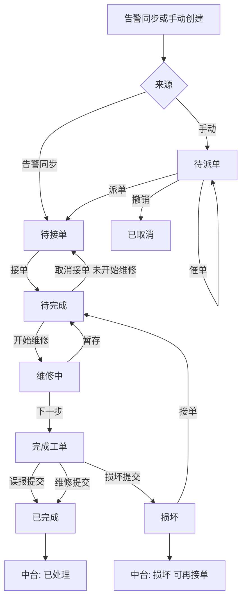

# 溧阳消防局智慧消防平台 — 告警中心与设施工单 PRD

| 项目 | 说明 |
|------|------|
| 文档版本 | V3.0 |
| 依据原型 | `src/pages/alarm/`、`src/pages/FacilityWorkOrder.tsx`、`src/store/alarmSync.ts`、`src/miniapp/`、`src/mock/alarmData.ts`、`src/mock/miniProgramData.ts` |
| 原型形态 | React 18 + Ant Design 5 中台 + H5 手机壳小程序（无真实后端，内存 Store 联动） |
| 更新说明 | 与当前代码严格对齐：已移除告警列表「模拟恢复」；设施工单详情不含「来源」；误报说明/维修描述/损坏描述仅详情只读展示 |

---

# 一、模块整体概述

## 1.1 模块名称、使用角色、核心业务目标

| 项 | 内容 |
|------|------|
| 模块名称 | 告警中心 + 中台设施工单 + 小程序设施工单全流程 + 小程序数据页告警统计 |
| 使用角色 | **中台管理员/调度员**：查看告警统计与列表、配置告警规则与同步策略、跟踪设施工单；**小程序运维/维修人员**（原型固定用户 `张维修`）：接单、现场维修、完成/误报/损坏填报；**小程序发起人**（部分工单）：派单、催单、撤销 |
| 核心业务目标 | 1）汇聚技防/人防告警并分级统计展示；2）按规则将符合条件的「待处理」告警自动生成设施工单；3）中台统一查看设施工单状态与小程序填报的说明类字段；4）小程序完成设施工单从派单→接单→维修→闭环（含损坏再处理）的全流程 |

## 1.2 页面/功能入口与跳转关系

### 1.2.1 中台（`App.tsx` → `MainLayout` 侧边栏 + 可关闭 Tab）

| 入口 | MenuKey | 页面组件 | 说明 |
|------|---------|----------|------|
| 告警中心 › 告警统计 | `alarm-stats` | `AlarmStatistics` | KPI + 图表 + 实时告警 |
| 告警中心 › 告警列表 | `alarm-list` | `AlarmList` | 告警记录表 + 告警信息设置 |
| 告警中心 › 告警设置 | `alarm-settings` | `AlarmSettings2` | 设备告警规则树表 |
| 设施工单（一级菜单） | `facility-work-order` | `FacilityWorkOrder` | 中台设施工单列表与详情 |

**端切换：** 顶栏下拉「中台管理系统 / 小程序」切换 `AppMode`（`admin` ↔ `mini`）。

**页面间跳转：** 无页面内按钮跨跳；仅通过侧边栏/Tab 切换。告警列表与中台设施工单通过 `alarmSync` Store **数据联动**（告警同步生成工单 ID `SG-{alarmId}`），无 URL 参数跳转。

### 1.2.2 小程序（`MiniProgramApp` 底部 Tab + 栈式路由）

| 底部 Tab | 路由 page | 子页面/跳转 |
|----------|-----------|-------------|
| 首页 | `home` | 工单受理宫格 → `list`（按类型）/ `my-orders` |
| 协作 | `collab` | 「我的工单」→ `my-orders` |
| 数据 | `data` | `MiniDataPage` 告警统计 |
| 我的 | `profile` | 个人中心（静态菜单） |

**设施工单核心跳转链：**

```
首页/协作 → 设施工单列表(list/facility) → 详情(detail/id)
  ├─ 待派单：撤销/催单/派单 → facility-form
  ├─ 待接单|损坏：接单（原地）
  ├─ 待完成：取消接单/开始维修 → repairing → 下一步 → complete → 提交 → 详情
  └─ 已完成|已取消：无底部操作
```

**返回逻辑：** 非根页面显示导航栏「‹」；`goBack` 优先回 `prevRoute`，否则回首页。

## 1.3 全局通用枚举字典

### 1.3.1 告警等级 `ALARM_LEVELS`

| 枚举值 | 业务含义 | UI 表现 |
|--------|----------|---------|
| 一级告警 | 最高优先级设备/火灾类告警 | Tag/饼图/列表文字色 `#ff4d4f`（红） |
| 二级告警 | 高优先级故障类 | `#fa8c16`（橙） |
| 三级告警 | 中等优先级（含设备超时） | `#fadb14`（黄） |
| 四级告警 | 较低优先级 | `#1890ff`（蓝） |

实时告警列表使用 `levelLabel`（一级预警~四级预警），左边框/图标同色 `LEVEL_WARN_COLORS`。

### 1.3.2 告警状态 `ALARM_STATUS`（告警列表）

| 枚举值 | 业务含义 | UI Tag color |
|--------|----------|--------------|
| 待处理 | 未处置 | `processing`（蓝动效） |
| 已处理 | 已闭环 | `success`（绿） |
| 误报 | 判定为误报 | `warning`（黄） |
| 损坏 | 关联设备/工单损坏态 | `error`（红） |

详情中若 `autoResolved=true`，状态后追加文案「（设备恢复传输自动解除）」。

### 1.3.3 告警描述 `ALARM_DESC_TYPES`

| 值 | 含义 |
|----|------|
| 火灾报警 | 火灾相关告警 |
| 故障报警 | 设备故障类 |
| 设备超时 | 设备离线超时（告警设置可配阈值） |

### 1.3.4 告警设备分类 `ALARM_DEVICE_CATEGORIES`

| 一级类别 | 二级子类（监测类型） |
|----------|---------------------|
| 消防设备 | 消防主机、烟感探测器、温感探测器、防火门 |
| 供水设备 | 生活水泵、消防水泵 |
| 电气设备 | 配电柜 |
| 垂直交通 | 电梯设备 |
| 安防监控 | 门禁系统、监控摄像头 |

**告警信息设置**仅可选：**消防设备**、**安防监控** 两类及其子类（`ALARM_FACILITY_SYNC_DEVICE_CATEGORIES`）。

### 1.3.5 中台设施工单状态 `FACILITY_ORDER_STATUS`

| 状态 | 含义 | Tag color |
|------|------|-----------|
| 待处理 | 未派单或未接单 | `warning` |
| 处理中 | 已接单维修中/待完成 | `processing` |
| 已处理 | 已完成（含误报/维修提交） | `success` |
| 损坏 | 提交损坏，可再次接单 | `error` |

### 1.3.6 小程序设施工单状态 `MINI_FACILITY_STATUS`

| 状态 | 含义 | 徽章 CSS 类 | 主色 |
|------|------|-------------|------|
| 待派单 | 手动创建未派单 | `mini-status-pending` | `#1890ff` |
| 待接单 | 已派单或告警同步待接单 | `mini-status-wait` | `#1890ff` |
| 待完成 | 已接单，维修进行中 | `mini-status-processing` | `#fa8c16` |
| 已完成 | 误报/维修提交完成 | `mini-status-done` | `#52c41a` |
| 已取消 | 撤销审批 | `mini-status-cancel` | `#999` |
| 损坏 | 提交损坏，重回工单池 | `mini-status-damage` | `#ff4d4f` |

**中台↔小程序映射（`platformStatusFromMini`）：** 待派单/待接单/已取消→待处理；待完成→处理中；已完成→已处理；损坏→损坏。

### 1.3.7 告警事故判断 `IncidentJudgment`（完成工单）

| 值 | 对应说明字段 | 图片要求 |
|----|-------------|----------|
| 误报 | 误报说明 | 误报图片必填，最多 9 张 |
| 维修 | 维修描述 | 维修图片选填，最多 9 张 |
| 损坏 | 损坏描述 | 损坏图片必填，最多 9 张 |

### 1.3.8 告警阈值 `ThresholdMode`（告警设置）

| 值 | 展示文案 | 说明 |
|----|----------|------|
| none | 无 | 仅第三方推送，不做额外阈值 |
| deviceTimeout | 设备离线超过{N}分钟（设备超时报警） | `customMinutes` 1–1440，默认 30 |

### 1.3.9 KPI 指标（中台告警统计 & 小程序数据页同源）

| 标签 | 含义（原型 mock 按周期系数计算） |
|------|--------------------------------|
| 待处置 | 待处理告警量 |
| 处置超时 | 超时未处置量 |
| 设备告警 | 设备类告警量 |
| 事件上报 | 人防事件上报量 |

小程序 KPI 圆圈色依次：`#1890ff`、`#fa8c16`、`#95de64`、`#bfbfbf`。

---

# 二、分页面需求说明

## 页面 1：【中台 — 告警统计】

**文件：** `src/pages/alarm/AlarmStatistics.tsx`

### 1. 页面用途与业务场景

调度/管理员登录中台后，总览告警 KPI、等级分布、趋势及实时告警流，用于日常监控与研判。技防/人防数据切换查看不同来源的实时列表。

### 2. 页面布局与区域划分

| 区域 | 位置 | 作用 |
|------|------|------|
| 顶栏筛选卡 | 顶部 Card | 标题 + 人防/技防 + 日/月/年 + 日期 + 查询 |
| KPI 卡片区 | 第二行 4 列 | 待处置/处置超时/设备告警/事件上报 |
| 左主区（16 栅格） | 中部左侧 | 告警等级分布饼图、告警趋势折线图 |
| 右实时区（8 栅格） | 中部右侧 | 实时告警 List |
| 详情弹窗 | 浮层 | 实时告警行「详情」 |

### 3. 筛选与查询逻辑

| 筛选项 | 类型 | 默认值 | 可选范围 | 空值/规则 | 生效时机 |
|--------|------|--------|----------|-----------|----------|
| 人防数据/技防数据 | Radio.Button | 技防数据 | 人防数据、技防数据 | — | **切换即生效**，切换 `realtimeList` 数据源 |
| 日/月/年 | Radio.Button | 月 | day/month/year | — | **切换即生效**，重算 KPI `getKpiCards(period)` |
| 日期 | DatePicker | 2025-01 | 日=date、月=month、年=year | `allowClear=false` | 仅改显示值；**不驱动 KPI/图表重算** |
| 趋势子筛选 | Radio（图表 extra） | 本月 | 今日/本月/全年 | — | **切换即生效**，`getTrendData` |
| 查询 | Button primary | — | — | — | 点击 → Toast「查询成功」；**不改变数据** |

**搜索/重置：** 本页无 SearchBar 重置按钮。

### 4. 功能按钮交互

| 按钮 | 动作 | 条件 |
|------|------|------|
| 查询 | `message.success('查询成功')` | 无 |
| 详情 ›（列表行） | 打开 Modal，传入 `detailId` | 任意实时行 |

无权限控制（原型未实现）。

### 5. 数据列表 — 实时告警

| 列/元素 | 释义 | 格式 |
|---------|------|------|
| 左边框色 | 等级色 | `LEVEL_WARN_COLORS[level]` |
| 告警名称 | `name` | 文本 + Tag `levelLabel` |
| 时间 | `time` | 文本 |
| 操作 | 详情 › | 链接 |

无复选框、无批量操作。

### 6. 分页与加载

实时列表为固定 mock 数组（人防 4 条、技防 4 条），无分页。无加载态/失败态组件。

### 7. 弹窗 — 告警详情

| 项 | 说明 |
|----|------|
| 触发 | 实时列表「详情 ›」 |
| 标题 | 告警详情 |
| 字段 | 告警名称、告警等级、数据类型（当前人防/技防选中值）、告警时间 |
| 底部 | `footer=null`，点遮罩或 X 关闭 |

### 8. 跳转与联动

无跨页跳转。人防/技防切换仅影响右侧列表与详情中「数据类型」展示。

### 9. 异常与边界

- 列表为空：当前 mock 恒有数据，未单独 Empty。
- 无网络/权限：原型未模拟。

---

## 页面 2：【中台 — 告警列表】

**文件：** `src/pages/alarm/AlarmList.tsx`、`AlarmFacilitySyncSettings.tsx`

### 1. 页面用途与业务场景

查看历史与当前告警全量记录，筛选查询，查看详情及关联设施工单信息；配置哪些等级+设备的「待处理」告警自动生成设施工单。

### 2. 页面布局

| 区域 | 作用 |
|------|------|
| SearchBar 筛选区 | 等级/状态/描述/时间范围 + 搜索/重置 |
| 操作条（右对齐） | 「告警信息设置」按钮 |
| 数据表格 | 告警记录 |
| 分页 | 底部分页器 |
| 弹窗 | 告警详情、告警信息设置 |

### 3. 筛选与查询逻辑

| 筛选项 | 默认值 | 可选 | 空值含义 | 组合规则 |
|--------|--------|------|----------|----------|
| 告警等级 | 空 | `ALARM_LEVELS` | 不过滤 | **前端即时 AND**（改下拉即过滤，无需点搜索） |
| 告警状态 | 空 | `ALARM_STATUS` | 不过滤 | 同上 |
| 告警描述 | 空 | `ALARM_DESC_TYPES` | 不过滤 | 同上 |
| 告警时间 | 空 | RangePicker | — | **未接入过滤逻辑**（UI 存在但不生效） |

| 按钮 | 逻辑 |
|------|------|
| 搜索 | Toast「搜索完成」；**不额外改变筛选**（筛选已即时生效） |
| 重置 | 清空三个 Select 筛选值 |

### 4. 功能按钮

| 按钮 | 动作 | 条件 |
|------|------|------|
| 告警信息设置 | 打开 `AlarmFacilitySyncSettingsModal` | 无 |
| 详情（行） | 打开告警详情 Modal | 每行 |

**已移除：** 告警列表「模拟恢复」按钮（`closeFacilityByAlarm` 仅 Store 保留，无 UI 入口）。

### 5. 数据表格

| 列 | 释义 | 展示 |
|----|------|------|
| 序号 | 当前页序号 | 1 起 |
| 告警ID | `id` | 文本 |
| 告警名称 | `name` | 文本 |
| 告警等级 | `level` | Tag + `LEVEL_COLORS` |
| 告警设备 | `alarmDevices` | 顿号拼接，ellipsis |
| 安装位置 | `installLocation` | 无则 `-` |
| 告警描述 | `desc` | 文本 |
| 告警状态 | `status` | Tag（见 1.3.2） |
| 告警时间 | `time` | 文本 |
| 解除告警时间 | `releaseTime` | 无则 `-` |
| 操作 | 详情 | 宽 80，fixed right |

无行复选框、无批量操作。

**设施工单联动（挂载时）：**
- `useEffect` 调用 `syncEligibleAlarmsToFacility(data)`：对列表中 **status=待处理** 且符合告警信息设置的告警，生成设施工单（`SG-{alarmId}`），跳过已存在 `alarmId`。
- 订阅 `subscribeAlarmFacilitySyncSettings`：设置变更后重新执行同步。

### 6. 分页

默认 `pageSize=10`，`showSizeChanger`，`showTotal`「共 {t} 条」。切换页码/条数仅前端分页，不请求接口。

**空状态：** Ant Design Table 默认 Empty（筛选无结果时）。

### 7. 弹窗 — 告警详情

| 字段 | 说明 |
|------|------|
| 告警ID~解除告警时间 | 直接回显 `AlarmListItem` |
| 告警状态 | 含 `autoResolved` 后缀 |
| 设施工单 | `facilityOrderLabel`：已有关联工单显示 `{order.id}（告警同步）`；符合设置未生成显示「符合设置条件，待处理时将自动生成」；否则「—（不在设施工单生成范围）」 |
| 关闭 | 底部 Button「关闭」 |

### 7.2 弹窗 — 告警信息设置

| 项 | 说明 |
|----|------|
| 触发 | 列表上方「告警信息设置」 |
| 标题 | 告警信息设置 |
| 说明 Alert | 列表展示全部告警；仅符合配置的「待处理」告警自动生成设施工单 |
| 可生成设施工单的告警等级 | Checkbox 多选，默认全选 `ALARM_LEVELS` |
| 可生成设施工单的告警设备 | 消防设备、安防监控 两类；支持类别全选/半选/子项多选 |
| 校验 | 等级≥1，设备≥1；失败 Toast warning |
| 保存 | `updateAlarmFacilitySyncSettings` → Toast「告警信息设置已保存」→ `onSaved` 触发同步，若新建>0 Toast info「已根据设置新生成 N 条设施工单」 |
| 取消 | 关闭不保存 |

### 8. 跳转与联动

- 告警同步 → `alarmSync.facilityOrders` 更新 → 中台设施工单页 `subscribeFacility` 刷新。
- 无页面 URL 跳转至设施工单页。

### 9. 异常与边界

- 筛选无结果：表格 Empty。
- 设置保存校验失败：见 7.2。
- 权限：未实现。

---

## 页面 3：【中台 — 告警设置】

**文件：** `src/pages/alarm/AlarmSettings2.tsx`

### 1. 页面用途

按设备二级子类配置告警等级与阈值规则（无/设备超时），支持增删改查与批量删除。

### 2. 页面布局

SearchBar → TableToolbar（新增/批量删除）→ 树形表格 → 新增/编辑 Modal。

### 3. 筛选与查询

| 筛选项 | 规则 |
|--------|------|
| 告警设备 | 关键词模糊匹配 `rootCategory` 或 `subCategory` |
| 告警等级 | 精确匹配 |
| 创建时间 | 闭区间 [startOf day, endOf day] |

点击**搜索**后写入 `applied*` 并过滤；有筛选时自动展开匹配的一级节点。点击**清空**重置草稿与应用条件并收起展开。

Toast：搜索「查询完成」。

### 4. 功能按钮

| 按钮 | 动作 |
|------|------|
| 新增 | 打开新增 Modal，默认三级告警、deviceTimeout、30 分钟 |
| 编辑 | 打开编辑 Modal，设备 Cascader **禁用** |
| 删除 | Confirm「确认删除」→ 删单条 |
| 批量删除 | 需选中子类行；Confirm「批量删除」 |

### 5. 树形表格

- **一级行（root）：** 设备类别名；列仅显示名称与子级数量；不可选、无操作。
- **二级行（category）：** 展示阈值、等级 Tag、创建时间；可选中、可编辑/删除。

| 列 | 二级行 |
|----|--------|
| 告警设备 | 子类名 |
| 子级数量 | 空 |
| 阈值 | `thresholdDisplay` |
| 告警等级 | Tag |
| 创建时间 | 文本 |
| 操作 | 编辑、删除（红） |

`rowSelection`：`checkStrictly`，仅 `rowType==='category'` 可选。

### 6. 分页

`pageSize=10`，`showQuickJumper`，`showTotal`「共 {filteredRules.length} 条」。

### 7. 弹窗 — 新增/编辑告警设置

| 字段 | 新增 | 编辑 | 规则 |
|------|------|------|------|
| 告警设备 | Cascader 多选二级 | 禁用 | 必填；新增至少选 1 个子类；已存在子类跳过并提示 |
| 告警等级 | Select | Select | 必填 |
| 告警阈值 | Radio none/deviceTimeout | 同左 | 必填；deviceTimeout 时离线时长 InputNumber 1–1440 必填 |

保存成功 Toast「新增 N 条成功」或「保存成功」；全重复时 error「所选子类均已配置告警规则」。

### 8. 联动

纯前端 `rules` state，与告警列表/设施工单 **无自动联动**（原型独立 mock）。

### 9. 异常

批量删除未选：warning「请选择要删除的子类」。表单校验失败：Ant Form 字段提示。

---

## 页面 4：【中台 — 设施工单】

**文件：** `src/pages/FacilityWorkOrder.tsx`

### 1. 页面用途

中台查看全部设施工单（告警同步 + 手动创建），按状态 Tab 与条件筛选，查看详情（含小程序填报的说明类字段，只读）。

### 2. 页面布局

SearchBar → 状态 Tabs → Info Alert 横幅 → 表格 → 工单详情 Modal。

### 3. 筛选与查询

| 筛选项 | 应用时机 | 规则 |
|--------|----------|------|
| 工单状态 | 点**搜索**写入 `applied` | 精确匹配 `status` |
| 告警等级 | 同上 | 精确 |
| 告警设备 | 同上 | `alarmDevices.includes(device)` |
| 告警月份 | 同上 | `alarmTime` 前缀匹配 `YYYY-MM` |

**状态 Tab（与搜索 AND）：** 全部 | 处理中 | 未处理(待处理) | 已处理 | 损坏。

**重置：** 清空草稿与应用筛选，Tab 回「全部」。

### 4. 功能按钮

| 按钮 | 动作 |
|------|------|
| 搜索 | 应用筛选 |
| 重置 | 见上 |
| 查看（行） | 打开详情 Modal |

**已移除：** 列表「填写说明」、损坏描述列、保存损坏说明；详情内说明字段 **只读**。

### 5. 数据表格

| 列 | 释义 |
|----|------|
| 序号 | 页内序号 |
| 工单编号 | `id` |
| 告警设备 | 数组顿号拼接 |
| 安装位置 | 文本 |
| 告警等级 | Tag |
| 告警描述 | `desc` |
| 告警时间 | `alarmTime` |
| 工单状态 | Tag（见 1.3.5） |
| 接单人 | `receiver`，损坏后可能为 `-` |
| 操作 | 查看 |

无复选框。Alert 横幅：「注：损坏状态的工单可被维修人员再次接单，进行维修处理」。

### 6. 分页

`pageSize=10`，`showSizeChanger`，`showTotal`「共 {t} 条」。

### 7. 弹窗 — 工单详情

| 字段 | 显示条件 |
|------|----------|
| 工单编号、告警设备、安装位置、告警等级、告警描述、告警时间、工单状态、接单人 | 始终 |
| 误报说明 | 存在 `falseAlarmNote` 或流转记录可解析时 |
| 维修描述 | 存在 `repairNote` 或流转记录可解析时 |
| 损坏描述 | **仅 status=损坏**；无内容显示灰色「暂无」 |

**不包含：** 来源字段（已从 UI 移除）。

有说明字段时底部 Alert：「误报说明、维修描述、损坏描述由小程序运维人员在完成工单时填写，中台仅可查看。」

Footer 仅「关闭」。

数据来源：`getFacilitySubmitNote(order, label)` 优先读 `falseAlarmNote`/`repairNote`/`damageNote`，否则从 `flowRecords.fields` 倒序解析。

### 8. 跳转与联动

`subscribeFacility()`：小程序任何状态变更、告警同步、设置触发的工单更新 → **列表自动刷新**。

无编辑/派单能力（派单仅在小程序待派单态）。

### 9. 异常

筛选无结果：Table Empty。详情只读，无保存失败场景。

---

## 页面 5：【小程序 — 首页】

**文件：** `MiniProgramApp.tsx` → `MiniHome`

### 1. 用途

维修人员入口：快速进入各类型工单列表与「我的工单」；展示通知公告、最新动态（静态 mock）。

### 2. 布局

Banner → 工单受理宫格（5 项）→ 通知公告 → 最新动态。

### 3. 工单受理宫格

| 入口 | 跳转 | 角标 |
|------|------|------|
| 报修工单 | `list/repair` | 非已完成/已关单/已取消报修数 |
| 设施工单 | `list/facility` | `getFacilityListOrders` 可见数 |
| 维保工单 | `list/maintenance` | 非已完成数 |
| 巡检任务 | `list/inspection` | 非已完成数 |
| 我的工单 | `my-orders` | 与当前用户相关工单数 |

角标 >99 显示 `99+`。

### 4–9. 其他

无筛选。公告/动态「查看更多 ›」无跳转实现。无弹窗。

---

## 页面 6：【小程序 — 工单列表（设施工单为重点）】

**文件：** `MiniWorkOrderList`

### 1. 用途

按工单类型 Tab 浏览工单池；设施工单遵循可见性规则（含损坏再处理、已完成全员可见）。

### 2. 布局

类型 Tab（报修/设施/维保/巡检）→ 状态筛选 chips → 卡片列表。

### 3. 设施工单状态筛选

可选：全部、待派单、待接单、待完成、已完成、损坏（**不含已取消**）。

点击 chip 切换；再点同一 chip 取消筛选。

### 4. 设施工单可见性 `isVisibleInWorkOrderList`

| 规则 | 说明 |
|------|------|
| 排除 | `status=已取消` |
| 工单池 | 待派单、待接单、损坏 → 全员可见 |
| 待完成 | 仅 `receiver=当前用户(张维修)` 可见 |
| 已完成 | 全员可见 |

### 5. 卡片字段

类型 Tag、创建时间、状态、问题类型（设施=「设施工单」）、问题描述（设施=告警设备）、安装位置（设施专有）。

空列表：「暂无工单」。

### 6. 跳转

点击卡片 → `detail/{id}`。设施工单走 `MiniFacilityDetail`；其他类型走 `MiniWorkOrderDetail`。

---

## 页面 7：【小程序 — 设施工单详情】

**文件：** `MiniFacilityViews.tsx` → `MiniFacilityDetail`

### 1. 用途

查看申请详情与流程记录；按状态执行派单/催单/撤销/接单/维修等操作。

### 2. 布局

申请详情卡（基础信息 KV + 状态徽章）→ 流程记录时间轴 → 底部操作栏（按状态）。

### 3. 基础信息字段（有值才展示可选项）

工单编号、告警设备、安装位置、告警等级、告警描述、告警时间、发起人、接单人、派单工作组、派单说明、到达现场时间、故障原因、**误报说明**、**维修描述**、**损坏描述**。

（不含「来源」——虽 `extra` 仍有 `来源` 数据，详情 KV 列表未展示该字段。）

### 4. 流程记录

按 `flowRecords` 时间轴展示：操作人+动作、结构化 fields 或 detail 文本、图片网格（若有 `images`）。空：「暂无流程信息」。

### 5. 底部按钮规则

| 状态 | 按钮 | 用户操作 → 系统响应 |
|------|------|---------------------|
| 待派单 | 撤销、催单、派单(primary) | 打开对应 form |
| 待接单、损坏 | 接单(primary) | `acceptFacilityOrder` → miniStatus=待完成；`onRefresh` |
| 待完成 + 我的 + 未开始维修 | 取消接单、开始维修(primary) | 取消→form；开始→`startFacilityRepair` + 跳转 repairing |
| 待完成 + 我的 + 已开始 | 继续处理(primary) | 跳转 repairing |
| 已完成、已取消 | 无 | — |

「我的」= `receiver === MINI_CURRENT_USER`（张维修）。

### 6. 跳转

各 form 类型见页面 8。接单/开始维修后刷新 Store 并导航。

---

## 页面 8：【小程序 — 设施工单表单】

**文件：** `MiniFacilityForm`、`MiniFacilityRepairingForm`

### 8.1 派单 `dispatch`

| 字段 | 必填 | 规则 |
|------|------|------|
| 处理人员-工作组 | 是 | `FACILITY_WORK_GROUPS` |
| 处理人员-姓名 | 是 | 随组联动 `FACILITY_WORKERS` |
| 派单说明 | 否 | max 500 |

确定 → `dispatchFacilityOrder`：待派单→待接单，写入工作组/说明/接单人；完成后回详情。

### 8.2 催单 `urge`

催单说明必填 max500 → `urgeFacilityOrder`（仅追加 `[催单]` 流转，**不改状态**）。

### 8.3 撤销 `revoke`

撤销说明必填 → `revokeFacilityOrder`：待派单→已取消（列表不可见，我的已办可见）。

### 8.4 取消接单 `cancel`

取消说明必填 → `cancelAcceptedFacilityOrder`（待完成且未开始维修）→ 待接单；`addHandledRecord` 归档至我的已办。

### 8.5 维修中 `repairing`（独立组件）

| 字段 | 必填 |
|------|------|
| 到达现场时间 | 是（datetime-local） |
| 故障原因 | 否，max500 |

| 按钮 | 动作 |
|------|------|
| 取消 | goBack |
| 暂存 | `holdOnSiteFacilityRepair`；alert「已暂存，工单状态为待完成」；回详情 |
| 下一步 | 校验到场时间 → `proceedFacilityRepairNextStep` → 跳转 complete |

### 8.6 完成工单 `complete`

**上部：** 工单信息复核（`FacilityFieldRows` 只读）。

**下部 — 维修填报：**

| 字段 | 规则 |
|------|------|
| 到达现场时间 | 必填；若从维修中下一步带入且已有 onSiteInfo，则 **readOnly** |
| 告警事故判断 | 到场时间填写后显示；误报/维修/损坏 三选一 |
| 误报说明 / 维修描述 / 损坏描述 | 依判断显示；必填；max500 |
| 误报图片/维修图片/损坏图片 | 误报/损坏必填；维修选填；最多 9 张；仅 image/* |

**底部按钮：**

| 判断 | 按钮 |
|------|------|
| 维修 | 取消、暂存、提交 |
| 误报/损坏 | 取消、提交 |

- **暂存（仅维修判断）：** `saveFacilityRepairDraft`，alert「已暂存，可稍后继续填写」。
- **提交：**
  - 误报 → `submitFalseAlarmFacilityOrder` → 已完成，写 `falseAlarmNote`
  - 维修 → `submitRepairFacilityOrder` → 已完成，写 `repairNote`
  - 损坏 → `submitDamageFacilityOrder` → 损坏，receiver=`-`，写 `damageNote`；`addHandledRecord`（我的已办）

校验失败：`alert` 提示（请填写…/请上传…/请选择…）。

### 8.7 表单通用

派单/催单/撤销/取消：底部「取消」「确定」。完成后 `onDone` → 刷新 Store → 导航详情。

---

## 页面 9：【小程序 — 协作 / 我的工单】

### 9.1 协作页 `collab`

「我的服务」→ 宫格「我的工单」（角标）→ `my-orders`。

### 9.2 我的工单 `my-orders`

**Tab：**

| Tab | 数据范围 |
|-----|----------|
| 我发起的 | `initiator=张维修` 且非 archiveOnly 且非已取消 |
| 我的待办 | `receiver=张维修` 且未完成未取消 |
| 我的已办 | 我完成的 + 我相关的已取消 + `handledRecords`（取消接单、提交损坏） |

**类型筛选：** 全部 / 报修 / 设施 / 维保 / 巡检。

点击卡片进详情。空：「暂无工单」。

---

## 页面 10：【小程序 — 数据 Tab】

**文件：** `MiniDataPage.tsx`

### 1. 用途

移动端查看告警 KPI 与等级分布（与中台 `alarmData` 同源函数）。

### 2. 布局

顶栏「数据」→ 子 Tab「告警统计」→ KPI 四宫格 → 周期 Tab（今日/本周/本月）→ 告警等级分布饼图。

### 3. 交互

切换周期 Tab → `getKpiCardsByRange(range)` 立即重算 KPI。

**无：** 趋势图、实时列表、查询按钮、详情弹窗。

### 4. 图表

`getLevelDistributionFour()` + `LEVEL_COLORS`；图高 300px。

---

# 三、核心业务流程说明

## 3.1 告警 → 设施工单自动生成

```
告警入库（待处理）
  → 告警列表加载 / 告警信息设置保存
  → isAlarmEligibleForFacilitySync（等级∈配置 AND 设备∩配置非空）
  → syncAlarmToFacility：创建 SG-{alarmId}，miniStatus=待接单，source=告警同步
  → notifyFacility → 中台设施工单列表刷新
```

## 3.2 设施工单完整闭环（小程序）



## 3.3 说明类字段同步（小程序 → 中台）

```
完成工单提交
  → 写入 falseAlarmNote / repairNote / damageNote + flowRecords
  → notifyFacility
  → 中台设施工单详情只读展示（列表不展示）
```

## 3.4 工单列表可见性（小程序）

- **已取消：** 仅「我的已办」可见，工单列表筛选不可选。
- **已完成设施工单：** 设施列表全员可见。
- **损坏：** 回到工单池，全员可接单。

---

# 四、接口与数据需求清单

> 原型阶段为前端 Store + Mock；下表为正式开发应对照的 REST 契约建议，字段与 `alarmSync.ts` / `alarmData.ts` 对齐。

## 4.1 告警中心

| 接口名称 | 用途 | 入参 | 出参 |
|----------|------|------|------|
| GET /api/alarms/statistics/kpi | KPI 卡片 | period: day/week/month/year | `{ label, value }[]` |
| GET /api/alarms/statistics/level-distribution | 等级分布 | — | `{ name, value }[]` |
| GET /api/alarms/statistics/trend | 趋势 | range: today/month/year | `{ x[], data[] }` |
| GET /api/alarms/realtime | 实时告警 | defense: 人防/技防 | `RealtimeAlarmItem[]` |
| GET /api/alarms | 告警列表 | page, pageSize, level, status, desc, timeStart, timeEnd | 分页 `AlarmListItem[]` |
| GET /api/alarms/{id} | 告警详情 | id | `AlarmListItem` + 设施工单关联信息 |
| GET /api/alarms/facility-sync-settings | 读取同步设置 | — | `{ levels[], devices[] }` |
| PUT /api/alarms/facility-sync-settings | 保存同步设置 | levels, devices | 更新后配置；触发待处理告警批量同步 |
| GET /api/alarm-rules | 告警设置列表 | keyword, level, createStart, createEnd | 树形或扁平规则列表 |
| POST /api/alarm-rules | 新增规则 | subCategories[], level, thresholdMode, customMinutes | 规则列表 |
| PUT /api/alarm-rules/{key} | 编辑规则 | level, thresholdMode, customMinutes | 单条规则 |
| DELETE /api/alarm-rules/{key} | 删除 | key | success |
| DELETE /api/alarm-rules/batch | 批量删除 | keys[] | success |

## 4.2 设施工单（中台）

| 接口名称 | 用途 | 入参 | 出参 |
|----------|------|------|------|
| GET /api/facility-orders | 列表 | page, pageSize, status, level, device, month, tabStatus | 分页 `FacilityOrderItem[]` |
| GET /api/facility-orders/{id} | 详情 | id | 含 falseAlarmNote, repairNote, damageNote, flowRecords |
| POST /api/facility-orders/sync-from-alarms | 按设置同步 | alarmIds 或自动扫描 | createdCount |

## 4.3 设施工单（小程序）

| 接口名称 | 用途 | 入参 | 出参 |
|----------|------|------|------|
| GET /api/mini/facility-orders | 可见列表 | userId, listType=pool/mine | `MiniWorkOrder[]` |
| GET /api/mini/facility-orders/{id} | 详情 | id | 详情 + flowRecords |
| POST /api/mini/facility-orders/{id}/dispatch | 派单 | group, worker, note | 更新后工单 |
| POST /api/mini/facility-orders/{id}/urge | 催单 | note | flow 记录 |
| POST /api/mini/facility-orders/{id}/revoke | 撤销 | note | status=已取消 |
| POST /api/mini/facility-orders/{id}/accept | 接单 | receiver | status=待完成 |
| POST /api/mini/facility-orders/{id}/start-repair | 开始维修 | receiver | repairStarted=true |
| POST /api/mini/facility-orders/{id}/cancel-accept | 取消接单 | reason | status=待接单 |
| POST /api/mini/facility-orders/{id}/on-site/hold | 维修中暂存 | arrivalTime, faultReason | onSiteInfo |
| POST /api/mini/facility-orders/{id}/on-site/next | 下一步 | arrivalTime, faultReason | repairDraft |
| POST /api/mini/facility-orders/{id}/draft | 完成页暂存 | FacilitySubmitPayload | repairDraft |
| POST /api/mini/facility-orders/{id}/submit/false-alarm | 提交误报 | payload + 图片 | falseAlarmNote, 已完成 |
| POST /api/mini/facility-orders/{id}/submit/repair | 提交维修 | payload + 图片 | repairNote, 已完成 |
| POST /api/mini/facility-orders/{id}/submit/damage | 提交损坏 | payload + 图片 | damageNote, 损坏 |

## 4.4 小程序数据

| 接口名称 | 用途 | 入参 | 出参 |
|----------|------|------|------|
| GET /api/mini/data/alarm-kpi | KPI | range: today/week/month | 同中台 KPI |
| GET /api/mini/data/alarm-level-distribution | 等级饼图 | — | 分布数组 |

## 4.5 核心数据结构摘要

**AlarmListItem：** id, name, level, alarmDevices[], installLocation, desc, status, time, releaseTime?, autoResolved?

**FacilityOrderItem：** id, alarmDevices[], installLocation, level, desc, alarmTime, status, miniStatus, receiver, alarmId?, source, falseAlarmNote?, repairNote?, damageNote?, initiator?, dispatchGroup?, dispatchNote?, repairDraft?, repairStarted?, onSiteInfo?, flowRecords[]

**FacilitySubmitPayload：** arrivalTime, judgment, note, faultReason?, photos[], photoNames[]

**FacilityFlowRecord：** time, action, operator, detail?, fields[{label,value}], images[]

---

# 附录：原型限制与未实现项

| 项 | 说明 |
|----|------|
| 权限控制 | 未区分角色权限，小程序用户写死 `张维修` |
| 告警列表时间筛选 | RangePicker 未接入 |
| 告警列表模拟恢复 | 已移除 UI |
| 设施工单中台编辑 | 无派单/处理入口，说明字段只读 |
| 网络/加载失败 | 无统一错误页 |
| closeFacilityByAlarm | Store 保留，无前端触发入口 |
| 真实上传 | 图片为本地 ObjectURL，未上传 OSS |

---

**文档结束**
